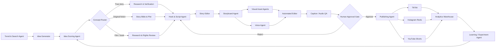
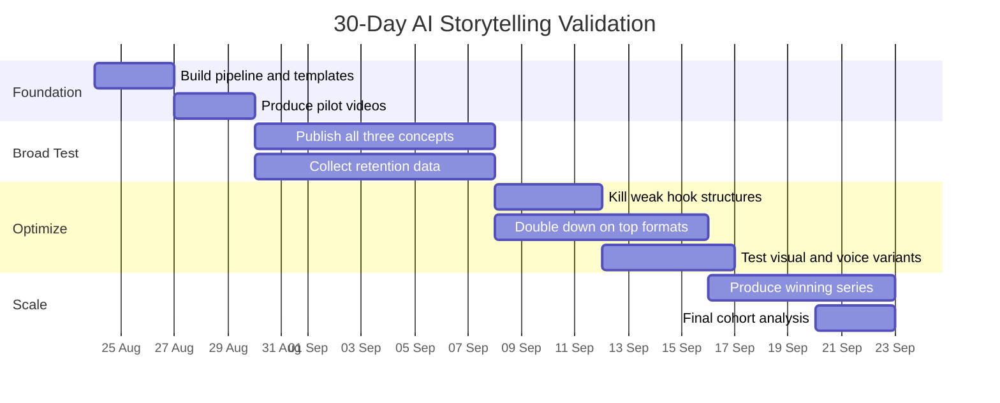

# Deep Research: The Three Short-Form Storytelling Concepts to Build With AI Agents

**Research date: 21 August 2026 · Target platforms: TikTok, Instagram Reels, YouTube Shorts · Language strategy assumed: English-first/global**

## Executive summary

The strongest opportunity is **not** to build a generic “AI video factory.” TikTok, Meta and YouTube are all moving in the opposite direction: toward original, distinctive, creator-led material and away from interchangeable, mass-produced or lightly repackaged videos. YouTube now explicitly says generic AI-generated templates that appear mass-produced can fail monetization standards; Meta says it is deprioritizing unoriginal Reels; and TikTok's Creator Rewards program requires original, high-quality videos longer than one minute. citeturn8view4turn8view5turn14search0

The market for storytelling itself is exceptionally strong. YouTube Shorts averages **more than 200 billion daily views**. Instagram reached **3 billion monthly active users** in 2025. TikTok passed **200 million monthly users in Europe alone** in 2025. Among U.S. adults, YouTube reaches 84%, Instagram 50% and TikTok 37%; usage of Instagram and TikTok is especially concentrated among younger adults. citeturn2search4turn2search1turn2search2turn9view0

My recommended portfolio is:

| Rank | Concept | Why I would build it |
|---|---|---|
| **Best starting concept** | **True “WTF?” micro-documentaries** | Best combination of curiosity, massive topic supply, automation, low production cost, cross-platform monetization and manageable copyright risk |
| **Best long-term IP concept** | **Original suspense / mystery microdrama** | Highest upside for retention, episodic binge behavior and creation of intellectual property you actually own |
| **Best existing-fandom concept** | **Book & film cultural explainers** | Huge proven BookTok/FilmTok audience and strong commercial intent, but must be commentary/analysis rather than straightforward copyrighted-story summaries |

The key strategic distinction is this:

> **Build a storytelling engine, not a summary engine.**

A channel whose proposition is simply “we summarize movies/books faster with AI” has an uncomfortable combination of copyright exposure, reused-content risk and weak differentiation. U.S. copyright law explicitly treats abridgments and condensations as forms of derivative works, while fair use depends on the circumstances and is generally less favorable where highly creative works such as movies and novels are concerned. Separately, YouTube can deny monetization for reused content even where the creator believes copyright or permission is not an issue. citeturn3search14turn3search3turn8view4

By contrast, **original stories, researched factual narratives and genuinely transformative cultural analysis** align much better with what the platforms are currently rewarding. Meta reports that views and watch time for original Facebook Reels approximately doubled in the second half of 2025 versus the same period of 2024, while Instagram increased the prevalence of original posts in U.S. recommendations to 75% in Q4 2025. citeturn8view5turn2search9

There is also a structural reason to design around **roughly 65–85 seconds** initially. TikTok Creator Rewards requires qualifying videos longer than one minute; YouTube Shorts uploaded under the newer Shorts rules can extend to three minutes and monetize; and the booming professional microdrama category operates approximately in the 45-second-to-two-minute range. citeturn0search1turn8view3turn9view4

**My practical recommendation:** build one common AI-agent platform but test all three concepts as separate content series. I would allocate roughly **50% of the first month's output to True WTF stories, 30% to original microdrama, and 20% to film/book analysis.** The purpose of month one is not revenue. It is to discover which combination of **hook → retention → shares → follows** your system can repeatedly produce.

## Market evidence and decision framework

### Why storytelling is unusually attractive right now

Short-form video's addressable audience is enormous and still expanding. YouTube said in January 2026 that Shorts averages 200 billion daily views. Instagram announced 3 billion monthly active users in September 2025, while TikTok said its European community exceeded 200 million monthly users that year. These figures are not directly comparable because they measure different things, but they demonstrate that distribution is not the bottleneck; the bottleneck is producing content that earns recommendation. citeturn2search4turn2search1turn2search2

Younger demographics remain particularly attractive for short-form storytelling. Pew's 2025 U.S. adult survey found that 80% of adults aged 18–29 use Instagram and roughly half of that age group visit TikTok daily. Among U.S. teenagers in the 2024 Pew study, 73% used YouTube daily, about six in ten visited TikTok daily and roughly half used Instagram daily. TikTok and Instagram also skew somewhat more female among teens. citeturn9view0turn9view1

TikTok's 2026 trend forecast explicitly identifies **“Curiosity Detours”** as a major behavior: users arrive with an intention and then move into unexpected discoveries. This is almost an ideal description of the psychological mechanism behind mystery, strange-history and “you won't believe what happened next” storytelling when it is done honestly rather than as empty clickbait. citeturn0search0turn0search10

The creator evidence points in the same direction. In a 2025 YouTube discussion with Shorts product lead Todd Sherman, creator Jenny Hoyos described the first second as critical and framed successful short storytelling around shock, intrigue and satisfaction. YouTube's 2025 case study of Dhar Mann similarly highlights rapid conflict introduction, rising tension and a climax as drivers of retention. citeturn1search2turn1search3

TikTok itself says watch time is generally weighted heavily in recommendations, while its Creator Rewards RPM incorporates metrics including average watch time and finish rate. YouTube tells creators to monitor watch time and audience retention; Instagram provides average watch time and a retention graph specifically so creators can identify where people stop watching. citeturn11search3turn11search0turn11search1turn11search2

That means the ideal agent system should not optimize only for views. It should optimize a sequence:

**stop the swipe → maintain uncertainty → deliver information/emotional escalation → provide payoff → create a reason to follow or watch the next episode.**

### Platform monetization implications

TikTok's current Creator Rewards requirements include at least **10,000 followers**, **100,000 video views in the preceding 30 days**, eligible-region requirements and original qualifying videos longer than one minute. Qualified videos begin generating rewards after reaching 1,000 qualified For You views. citeturn14search0turn7search2

For YouTube's full ad-revenue path, the standard Shorts route requires **1,000 subscribers and 10 million qualified public Shorts views in 90 days**. Monetizing Shorts creators receive 45% of the revenue allocated to them from the Shorts Creator Pool. Importantly for an Armenia-based creator, YouTube lists **Armenia as a YPP-available market**. citeturn0search5turn8view3turn6search0

Instagram is less suitable for a business model based solely on predictable per-view payments. Current creator monetization products include Gifts, Subscriptions, branded content and various bonuses; Gifts require, among other conditions, a professional account, age 18+ and at least 500 followers, but monetization products remain country/feature dependent. Current Instagram bonus programs can also be invitation-based and geographically restricted. citeturn13search0turn13search5turn13search15

**TikTok Creator Rewards availability for an Armenia-based account is unspecified in the public TikTok material I found.** TikTok states that creators must be based in an eligible region, but the accessible public support result did not provide a definitive Armenia eligibility list. I would therefore treat TikTok direct payouts as upside rather than the foundation of the financial model until the account itself confirms eligibility. citeturn7search0turn14search0

Instagram Reels should initially be viewed as **distribution + audience + sponsorship potential**, YouTube Shorts as the clearest globally scalable ad-revenue path from Armenia, and TikTok as the strongest experimentation/discovery surface where Creator Rewards may become relevant subject to account eligibility. Cross-posting to Facebook is also worth considering because Meta's Facebook Content Monetization program pays for eligible Reels and Meta is explicitly giving greater reach to original content. citeturn6search0turn13search19turn8view5

### How I scored the concepts

The following scores are my analytical assessment, not published platform benchmarks. I weighted:

**Virality 25% · automation 20% · copyright safety 15% · production economics 10% · monetization 15% · long-term defensibility/IP 15%.**

“Copyright safety” means 10 = comparatively low risk. “Cost efficiency” means 10 = inexpensive to produce.

## Comparative ranking

| Concept | Virality | Automation | Copyright safety | Cost efficiency | Monetization | Defensibility | Overall |
|---|---:|---:|---:|---:|---:|---:|---:|
| **True WTF micro-documentaries** | 9.0 | **9.2** | 8.6 | **9.2** | **9.0** | 8.3 | **8.9/10** |
| **Original suspense microdrama** | **9.7** | 8.3 | **9.3** | 6.8 | 8.7 | **9.5** | **8.9/10** |
| **Book/film cultural explainers** | 9.4 | 8.6 | 5.5 | 8.3* | 7.2 | 7.5 | **7.9/10** |

\*Production itself is cheap; licensing expenses, where required, are **unspecified** and can materially alter the economics.

The first two are essentially tied mathematically. I put **True WTF first operationally** because it gives you a much faster route to hundreds of experiments. Microdrama has greater long-term upside but requires stronger art direction, visual consistency and narrative QA.

The third concept is deliberately **not “movie summaries.”** Film and book fandom is huge: TikTok says an average of **6.5 million film/TV posts were shared per day during 2025**, and at least 15 of Europe's 20 top-performing cinema films were viral on TikTok. #FilmTok itself grew 94.7% between April 2024 and April 2025 to more than 1.8 million posts. citeturn9view2turn4search5

BookTok is similarly substantial. TikTok reported in March 2026 that more than **50 million BookTok-recommended books were sold across key European markets during 2025**, generating €800 million; more than one-third of surveyed 16–39-year-olds discovered books through BookTok. citeturn9view3

So the audience is attractive. The issue is **format choice**: analyze stories rather than replacing them.

## True “WTF?” micro-documentary storytelling

**Recommendation:** This is the concept I would use to train the first version of your autonomous content engine.

The channel promise is:

> **“One unbelievable true story in about a minute.”**

Subjects can include strange historical events, unexplained-but-documented incidents, science stories, forgotten inventions, survival stories, unusual crimes, bizarre corporate decisions, archaeological discoveries, geography, aviation, technology and psychologically surprising real events.

This format fits TikTok's current “curiosity” direction and has almost unlimited source material. It also avoids dependence on a single entertainment franchise. citeturn0search0turn11search15

**Audience profile:** exact concept-specific global demographics are **unspecified** in available primary platform data. I would target 18–44 initially, but this is a strategy assumption rather than a published platform demographic. The underlying platforms reach very large young-adult populations: Instagram use reaches 80% among U.S. adults aged 18–29, roughly half that age group visits TikTok daily, and YouTube has broad majority usage across every adult age cohort Pew measured. citeturn9view0

| Operating dimension | Recommendation |
|---|---|
| Ideal length | **65–80 seconds** |
| Story density | ~150–190 spoken words |
| Production complexity | Low–medium |
| Automation feasibility | **Very high** |
| Visual style | Archival/public-domain material + maps + generated reconstructions + kinetic typography |
| Voice | One consistent narrator |
| Captions | Mandatory, word/phrase highlighted dynamically |
| Music | Quiet tension/curiosity bed; licensed/platform-cleared |
| Human QA | Research accuracy, title/hook, visual factuality |
| Modelled human time/video | **12–25 min** once pipeline is mature |
| Modelled machine/render time | **5–20 min** depending on generated video use |
| Modelled variable compute cost | **~$0.40–$3/video** |
| Copyright risk | Low–medium |
| Monetization fit | **Excellent** |

The cost figures above are **my production-model estimates**, not published vendor rates. They exclude subscriptions, human labor, stock licenses and unusual generation retries. Heavy premium text-to-video use would raise them substantially.

**Five hooks/titles**

1. **“A town disappeared from the map — while thousands of people still lived there.”**
2. **“This man survived something doctors said should have killed him instantly.”**
3. **“For six days, an entire city couldn't explain this sound.”**
4. **“A mistake worth $300 million started with one missing character.”**
5. **“Scientists found something impossible inside a place nobody had opened for centuries.”**

The agent should produce dozens of hook candidates, but the research agent must prevent the hook from promising something that the evidence cannot deliver. YouTube now specifically warns against deceptive AI imagery or narratives that make viewers believe fictional disasters or celebrity deaths are real. citeturn8view4

**60–90 second script template**

> **0–3s — contradiction**  
> “In [year], [person/place] did something that should have been impossible.”
>
> **3–10s — establish reality**  
> “And this isn't an internet legend. [Short concrete verification detail].”
>
> **10–23s — setup**  
> “It started when [simple causal event]. At first, everyone thought [expected explanation].”
>
> **23–40s — escalation**  
> “But then [unexpected evidence]. And that's when the story gets strange.”
>
> **40–57s — second turn**  
> “[Specific fact/detail] meant their original explanation couldn't be right.”
>
> **57–70s — payoff**  
> “The actual reason was [reveal], which caused/resulted in [consequence].”
>
> **70–80s — memory anchor / optional open question**  
> “The strangest part? [one final verified detail].”
>
> Optional CTA: “Would you have believed it?”

The principle is **question → evidence → complication → answer**, rather than a random succession of facts. That matches the retention guidance YouTube gives creators: maintain anticipation and curiosity and use retention analytics to identify weak moments. citeturn11search16turn11search10

**Storyboard**

| Time | Shot | Visual | Caption function | Audio |
|---|---|---|---|---|
| 0–3s | Cold open | Most impossible-looking image/reconstruction | Hook, 5–8 words | Impact + narration |
| 3–8s | Context | Map/date/place | Establish credibility | Low tension bed |
| 8–16s | Event begins | Generated reconstruction or archive | Key noun/number | Narration |
| 16–25s | Expected explanation | Diagram/object/person | “Everyone thought…” | Subtle rise |
| 25–36s | Contradiction | Visual hard cut | New evidence | SFX accent |
| 36–48s | Escalation | 2–3 rapid source-based visuals | Important facts | Faster pacing |
| 48–62s | Reveal | Clear explanatory image/diagram | Answer | Music release |
| 62–75s | Consequence | Human/result image | Why it mattered | Narration |
| 75–80s | Exit | Strong final still / loopable shot | Final surprise/question | End beat |


*The mockup is schematic: the production version should use far more visual movement and evidence-grounded imagery.*

**Recommended agent mapping**

| Agent | Main responsibility | Automation level |
|---|---|---:|
| Trend/Search Agent | TikTok Search Insights, search demand, emerging subjects | 90% |
| Research Agent | Find primary/reputable sources and extract timeline | 85% |
| Verification Agent | Cross-source claims, dates, names, statistics | 70% |
| Idea/Hook Agent | Generate 20–50 angles and hooks | 100% |
| Story Editor Agent | Narrative arc and 150–190-word script | 90% |
| Rights Agent | Classify visuals as owned/licensed/public-domain/generated | 80% |
| Storyboard Agent | Break script into 8–14 visual beats | 100% |
| Asset Agent | Generate reconstructions/maps/title cards | 90% |
| Voice Agent | TTS narration | 100% |
| Edit Agent | Captions, pacing, SFX, music ducking, export | 90% |
| QA Agent | Claim-to-source mapping and visual consistency | 70% |
| Publisher Agent | Metadata + platform upload | 80–100% |
| Analytics Agent | Retention/share/follow analysis | 100% |

TikTok provides official Content Posting APIs for direct posting or draft uploads; Meta provides an Instagram Content Publishing API for Reels; and YouTube's Data API supports programmatic uploads, so the final distribution stage is technically automatable once app permissions and platform requirements are satisfied. citeturn10search0turn10search1turn10search2

**Production checklist**

- [ ] At least two reliable sources support the central claim.
- [ ] Every number/date/proper name has an evidence record.
- [ ] The hook is dramatic **without changing the fact**.
- [ ] No archive image is used unless rights status is known.
- [ ] AI reconstruction is marked appropriately where realistic.
- [ ] First major story turn occurs before approximately 20–25 seconds.
- [ ] A genuine answer/payoff arrives before the end.
- [ ] Captions have been visually checked, not just auto-transcribed.
- [ ] 9:16 master is exported without another platform's watermark.
- [ ] Source list and asset provenance are saved internally.

**Risk mitigation**

The main legal advantage here is that copyright does not protect facts themselves, although it does protect authors' original expression of those facts. Therefore the research agent should extract **facts and facts only** and then write a completely new narrative rather than closely paraphrasing one article. citeturn3search26

Use government, institutional and public-domain imagery when practical; otherwise generate your own reconstruction or license stock. Do not simply scrape documentary footage.

For realistic synthetic scenes, use the platforms' disclosure mechanisms. TikTok provides AI-generated-content disclosure tools, and YouTube requires disclosure for realistic altered or synthetic material. citeturn3search0turn3search1

For sensitive real-world stories, require human approval before publishing. Medical, criminal and death-related stories have substantially higher factual/reputational risk.

**KPIs**

The primary hierarchy should be:

**initial hold → average percentage viewed → completion → shares/1,000 views → follows/1,000 views → saves → comments → search traffic.**

Do not adopt arbitrary universal “viral benchmarks.” YouTube explicitly supports comparing retention against videos of similar length, which is a better methodology. After 20–30 uploads, establish your own baseline per duration and compare concepts against that baseline. citeturn11search7turn11search13

**Growth strategy:** once a topic family repeatedly wins, turn it into a named franchise such as **“Impossible But True,” “One Minute Mysteries,” “History's Weirdest Mistakes,”** or **“Things That Actually Happened.”** Then localize successful videos into Spanish, German, French or other languages rather than translating every experiment. The agent should only localize proven winners.

## Original suspense and mystery microdrama

This has the **highest pure storytelling upside** of the three concepts.

The proposition is:

> **Original 60–90 second episodes built around an impossible situation, escalating danger and a cliffhanger or reveal.**

Examples include thriller, sci-fi, horror, relationship mystery, alternate reality and psychological suspense.

This is no longer merely a TikTok subculture. Microdramas have become a meaningful entertainment category. Reuters reported on 18 August 2026 that the U.S. microdrama audience reached **66 million monthly active users in 2025**, more than double 2024's 26 million, with projected U.S. revenue of $1.5 billion in 2026. Episodes generally run from about 45 seconds to two minutes. citeturn9view4

The established microdrama audience currently has a pronounced female skew: Reuters, citing Omdia, reports women aged 25–55 as the category's core U.S. audience. However, broader genre services are seeing strong growth among ages 22–27, particularly as sci-fi, fantasy and horror expand beyond romance. citeturn9view4

Deloitte's 2026 media outlook similarly describes mobile microdramas as series consisting of potentially hundreds of **60–90 second episodes packed with plot twists and cliffhangers**, refined rapidly through audience feedback. citeturn5search1

The strongest proof-of-format case is unusually large: Reuters reports that Issa Rae's TikTok microdrama **“Screen Time” attracted 500 million views in one month**. citeturn9view4

| Operating dimension | Recommendation |
|---|---|
| Ideal length | **60–90 seconds**, occasionally 45–60 for discovery |
| Spoken words | ~120–180 depending on dialogue |
| Production complexity | Medium–high |
| Automation feasibility | High |
| Visual style | Consistent characters + cinematic generated/reconstructed scenes |
| Voice | 2–4 recurring character voices or narrator + dialogue |
| Captions | Dialogue-focused; less text than micro-doc |
| Music | Strong tension architecture |
| Human QA | Story logic, acting/voice, character continuity, policy |
| Modelled human time/video | **20–45 min** mature pipeline |
| Modelled machine/render time | **15–45 min** |
| Modelled variable compute cost | **~$2–$15/video** |
| Premium-generation/retry cases | May exceed **$15/video** |
| Copyright risk | **Low if wholly original** |
| Monetization fit | Excellent |
| Long-term IP potential | **Exceptional** |

Again, those production figures are **modelled estimates**, excluding labor and fixed subscriptions.

**Five hooks/titles**

1. **“At 3:17 AM, her dead sister texted: ‘Don't open the door.’”**
2. **“Every morning he wakes up one day earlier.”**
3. **“She installed a camera to see who entered her apartment. The camera showed her.”**
4. **“In 2049, everyone gets the exact date they will die — except him.”**
5. **“The astronaut came home after six months. Earth said he'd been gone for 27 years.”**

The title/hook should define one clear **story engine** immediately. Avoid generic “something scary happened” openings. The YouTube Shorts creator guidance emphasizing a first-second hook and Dhar Mann's conflict-first structure strongly support this approach. citeturn1search2turn1search3

**60–90 second script template**

> **0–3s — impossible event**  
> “[Character] receives/sees/discovers [thing that should not be possible].”
>
> **3–12s — rule of the world**  
> “There was only one problem: [rule/constraint].”
>
> **12–25s — first decision**  
> “So [character] does [reasonable action].”
>
> **25–38s — consequence**  
> “That makes things worse because [escalation].”
>
> **38–52s — apparent explanation**  
> “Then [character] realizes [partial answer].”
>
> **52–67s — reversal**  
> “But the answer means something even worse: [second interpretation].”
>
> **67–78s — confrontation/reveal**  
> “[Character] opens/finds/faces [payoff].”
>
> **78–85s — cliffhanger**  
> “And then [one sentence that reopens the problem].”
>
> **85–90s — optional episode tag**  
> “Part two: [specific promise],” not merely “follow for part two.”

A strong series alternates **closed-payoff episodes** and **cliffhanger episodes**. If every video ends without satisfying anything, audiences can eventually perceive the series as manipulative. YouTube's current monetization policy explicitly warns against heavily repetitive, emotionally manipulative or shock-only content and requires a cohesive, satisfying narrative. citeturn8view4

**Storyboard**

| Time | Shot | Visual | Narrative purpose |
|---|---|---|---|
| 0–4s | Extreme close-up | Phone/message/object | Impossible hook |
| 4–10s | Character reaction | Same recurring protagonist | Emotional grounding |
| 10–18s | Establish location | Apartment/street/spaceship etc. | Rule/world |
| 18–28s | Action | Character investigates | Forward movement |
| 28–38s | New clue | Camera/photo/door/reflection | Escalation |
| 38–50s | False answer | Evidence appears explanatory | Temporary relief |
| 50–62s | Contradiction | New visual interrupts | Reversal |
| 62–74s | Confrontation | Character approaches answer | Maximum tension |
| 74–84s | Reveal | Clear visual payoff | Satisfaction |
| 84–90s | Final shot | New impossible element | Next-episode hook |


The professional microdrama market reinforces this structure: Reuters describes viewers being dropped directly into the story and the cliffhanger as a central mechanism of the format. citeturn9view4

**Recommended agent mapping**

| Agent | Main responsibility | Automation |
|---|---|---:|
| Trend Agent | Identify currently resonant emotional/genre themes | 85% |
| Premise Agent | Generate high-concept “what if?” premises | 100% |
| Series Bible Agent | Characters, rules, locations, canon | 95% |
| Plot Agent | 10–30 episode season architecture | 90% |
| Episode Writer | Script individual episodes | 90% |
| Continuity Agent | Detect contradictions across episodes | 90% |
| Hook/Cut Agent | Optimize first 3 sec + cliffhanger | 100% |
| Casting/Voice Agent | Persistent voices/personas | 95% |
| Visual Continuity Agent | Character references, wardrobe, locations | 80% |
| Generation Agent | Still/video asset creation | 90% |
| Edit Agent | Cuts, subtitles, SFX, score | 90% |
| Quality Director | Human-facing quality/risk score | 70% |
| Publishing Agent | Variant titles/captions and uploads | 90% |
| Analytics Agent | Episode retention and binge progression | 100% |

The **Series Bible Agent** is critical. Without it, generative systems tend to mutate faces, clothing, chronology, locations and story rules. The database should store structured character/state data separately from prompts.

**Production checklist**

- [ ] Premise can be understood within three seconds.
- [ ] Protagonist and conflict are obvious by 10 seconds.
- [ ] Every episode changes the situation materially.
- [ ] Character IDs/reference images are locked.
- [ ] Dialogue reads naturally at spoken speed.
- [ ] Each episode contains at least one genuine revelation.
- [ ] Episode still works for a viewer who did not watch the previous part.
- [ ] Cliffhanger promises a specific event or answer.
- [ ] Realistic synthetic content is disclosed where required.
- [ ] All voices, music and generated assets have commercially suitable rights.

**Risk mitigation**

The copyright profile is excellent **only when the story is truly original**. Do not ask the system for “a story just like [specific movie/show] with different names.” Make the premise agent run a similarity check against major fictional properties before approval.

There is a second, subtler IP issue: in the United States, the Copyright Office says copyright protects human-authored material in AI-assisted works, but purely AI-generated material and material lacking sufficient human control may not qualify for copyright. Prompts alone normally do not establish sufficient authorship. Human selection, arrangement and creative modification can qualify. citeturn12search0turn12search1

For valuable series, therefore, maintain **documented human authorship**: manually approve/edit the premise, revise final scripts, define the story bible, select shots, adjust dialogue and retain editorial history. This is both a creative-quality recommendation and a stronger intellectual-property posture based on current U.S. Copyright Office guidance. citeturn12search0

You should also avoid endless generic horror scenarios. YouTube specifically permits AI used to visualize a creator's unique characters and narratives but warns against repetitive disturbing scenarios and AI clips lacking a coherent narrative. citeturn8view4

**KPIs**

In addition to the basic retention metrics, microdrama requires **series-level** measurement:

**Episode-1 → Episode-2 continuation rate · follows per 1,000 views · returning viewers · profile visits · playlist/series consumption · completion · shares · comments asking for continuation.**

A particularly useful experimental measure would be:

\[
\text{Story Conversion} =
\frac{\text{follows + next-episode viewers}}{\text{unique viewers}}
\]

This is a custom operating metric, not a platform-published metric.

**Growth strategy:** create **three story universes rather than 30 unrelated series**. For example:

“Messages From Tomorrow” → sci-fi mystery  
“Apartment 404” → supernatural thriller  
“The Last Memory” → psychological mystery

When one wins, produce longer arcs, compilation episodes and eventually 3–10 minute YouTube videos. This builds actual IP rather than merely accumulating disconnected views.

## Book and film cultural explainers

This is the closest to the content direction you originally described, but I would **change the product definition**.

Do not build:

> “Here's the entire movie/book in 75 seconds.”

Build:

> **“Here's the hidden idea, twist, character decision, ending interpretation or recommendation that makes this story fascinating.”**

Examples:

**“The detail everyone misses in Shutter Island.”**  
**“Why this villain was actually right about one thing.”**  
**“The novel whose ending means the opposite of the movie's.”**  
**“Three books where the narrator is lying to you.”**

The audience evidence here is exceptional. TikTok says film/TV generated an average of 6.5 million posts per day in 2025; nearly half of U.S. TikTok users in earlier platform research said they had discovered a new theatrical movie there. #FilmTok grew 94.7% from April 2024 to April 2025. citeturn9view2turn4search1turn4search5

BookTok has similarly demonstrated real-world commercial influence. More than 50 million BookTok-recommended books were sold across key European markets in 2025, representing €800 million in revenue according to the data TikTok published from NielsenIQ BookData and Media Control. More than one-third of surveyed 16–39-year-olds discovered new books on BookTok. citeturn9view3

There are also clear creator precedents. TikTok highlighted Cinema Joe as a film/TV creator with more than one million engaged followers, while 2025 Cannes creator profiles included film recommendation, horror-analysis and deep-dive creators. BookTok creator Jack Edwards had 656,000 followers when TikTok profiled him in 2024. citeturn4search7turn4search5turn4search12

| Operating dimension | Recommendation |
|---|---|
| Ideal length | **60–85 seconds** |
| Spoken words | ~150–200 |
| Complexity | Low–medium |
| Automation feasibility | High |
| Visual style | Original motion graphics + generated thematic visuals + licensed/public-domain assets |
| Voice | One recognizable narrator/personality |
| Captions | Strong, especially names/themes |
| Music | Platform-cleared or original |
| Human QA | **High: copyright + interpretation + factual accuracy** |
| Modelled human time/video | **15–35 min** |
| Modelled machine/render time | **8–20 min** |
| Modelled variable compute cost | **~$0.50–$4/video**, excluding licenses |
| Licensing expense | **Unspecified** |
| Copyright risk | **Medium–high** |
| Monetization fit | Medium–high if truly transformative |

**Five hooks/titles**

1. **“The detail everyone misses in this movie completely changes the ending.”**
2. **“This famous villain tells you his entire plan in the first 10 minutes.”**
3. **“This book tricks you with one word in the very first chapter.”**
4. **“The movie changed one detail from the novel — and it changed the whole story.”**
5. **“Three books where you can't trust the person telling the story.”**

Notice that these are **analysis/recommendation propositions**, not “watch this instead of the original.”

**60–90 second script template**

> **0–3s — thesis**  
> “Everyone remembers [obvious thing], but the important detail is [unexpected interpretation].”
>
> **3–12s — minimal context**  
> “In [work], [one-sentence setup — not a full plot recap].”
>
> **12–25s — evidence one**  
> “Early in the story, [specific detail] happens.”
>
> **25–38s — conventional reading**  
> “Most viewers/readers interpret this as [common interpretation].”
>
> **38–52s — second evidence**  
> “But later, [another detail] changes that.”
>
> **52–67s — original analysis**  
> “Together, those scenes suggest [your thesis].”
>
> **67–78s — payoff**  
> “That means the ending isn't really about [surface reading]. It's about [deeper reading].”
>
> **78–85s — engagement**  
> “Did you read it the same way?”

For recommendation videos:

> Hook → emotional promise → three non-spoiler story characteristics → who should read/watch it → final recommendation.

**Storyboard**

| Time | Shot | Recommended visual source | Function |
|---|---|---|---|
| 0–4s | Hook card | Original design | Thesis |
| 4–10s | Work identifier | Cover/poster only where rights/use permits | Context |
| 10–18s | Symbolic reconstruction | AI/original artwork | Evidence |
| 18–28s | Diagram/text | Original graphic | Explain detail |
| 28–38s | Character/theme visualization | Generated | Conventional reading |
| 38–50s | Second clue | Generated or licensed asset | Reversal |
| 50–64s | Visual comparison | Original graphic | Analysis |
| 64–76s | Strong thematic visual | Original/generated | Conclusion |
| 76–85s | Comment prompt | Original branded end card | Discussion |


**Recommended agent mapping**

| Agent | Main responsibility | Automation |
|---|---|---:|
| Fandom Trend Agent | Trending titles, releases, BookTok/FilmTok signals | 90% |
| Source Agent | Reviews, interviews, primary material notes | 80% |
| Rights Agent | Rights classification of every external asset | 70% |
| Thesis Agent | Generate original analytical angles | 95% |
| Spoiler Agent | Classify spoiler/no-spoiler versions | 100% |
| Script Agent | Commentary-driven script | 90% |
| Similarity Agent | Prevent long reproduction/paraphrase | 90% |
| Visual Agent | Original thematic imagery/diagrams | 90% |
| Voice/Edit Agents | Narration, captions, pacing | 95% |
| Legal/QA Gate | Human approval of final use | 50–70% |
| Publishing Agent | Metadata + title variants | 90% |
| Analytics Agent | Title/topic/fandom performance | 100% |

**Production checklist**

- [ ] Video has an original thesis, recommendation or criticism.
- [ ] Plot recap is only the minimum necessary context.
- [ ] Script does not reproduce dialogue at length.
- [ ] Every external visual has a documented rights rationale.
- [ ] The video does not substitute for experiencing the original work.
- [ ] Creator commentary is the dominant element.
- [ ] Trailer/movie/book assets are not assumed to be “fair use” merely because the clip is short.
- [ ] Copyright-sensitive videos receive human review.
- [ ] AI images do not impersonate actors in a misleading realistic context.
- [ ] Description identifies spoilers where relevant.

**Why I reject straightforward movie summaries**

U.S. law defines a derivative work to include an **abridgment or condensation** of an existing work. Fair use can protect criticism, commentary and other transformative uses, but it is a case-by-case analysis; the Copyright Office specifically notes that use of highly creative material such as novels or movies is generally less favorable under the second fair-use factor than factual material. citeturn3search14turn3search3

And copyright is only half the risk.

YouTube's monetization rules say that movie/show clips compiled with little or no narrative can fail reused-content policy. Critical reviews, meaningful commentary and substantially transformed clips may qualify for monetization, but YouTube explicitly says its reused-content judgment is distinct from copyright analysis. citeturn8view4

Meta's 2026 guidance is similar: simply stitching clips or narrating what is already visible without adding meaningful information is considered unoriginal and can be deprioritized; genuine analysis or substantial storyline improvements are treated more favorably. citeturn8view5

Therefore the safest scalable architecture is:

**movie/book → research → thesis → original script → original visual language**

rather than:

**movie → downloaded clips → AI narration → captions.**

**KPIs**

Beyond standard retention:

**shares/1,000 · saves/1,000 · comments/view · search traffic · profile visits · follow conversion · performance by franchise/genre · spoiler vs non-spoiler retention · recommendation-driven affiliate/conversion metrics where legally/platform-appropriately available.**

Book/film content should have stronger **save and share behavior** than pure fiction because it can function as a recommendation list. That is a strategic hypothesis to validate, not a published universal platform benchmark.

**Growth strategy:** specialize before broadening. A generic “movies/books” account is less memorable than:

**“Movies With Hidden Details”**  
**“Books That Mess With Your Mind”**  
**“One-Minute Story Analysis”**  
**“Horror Explained Without the Recap”**

Once audience identity is established, add adjacent categories.

## Agent architecture, testing plan and prioritized sources

The key engineering mistake would be to create twenty autonomous agents that all call an LLM independently. Architect this as a **stateful workflow with explicit artifacts and gates**.

Each video should have a persistent content object approximately like:

```text
ContentIdea
  id
  concept_type
  topic
  target_audience
  hook_candidates[]
  selected_hook
  source_claims[]
  source_urls[]
  rights_records[]
  script_versions[]
  storyboard[]
  asset_manifest[]
  voice_asset
  edit_manifest
  risk_score
  qa_status
  platform_variants[]
  publication_ids{}
  analytics{}
  learnings[]
```

This provides traceability between **idea → factual evidence → rights → script → assets → publishing → performance**.

A sensible overall pipeline is:



Programmatic publishing is feasible across the three target platforms, although permissions and account types matter. TikTok's Direct Post API supports posting directly to authorized creator profiles; Instagram's Content Publishing API supports Reels; YouTube's `videos.insert` endpoint supports automated video upload. citeturn10search0turn10search3turn10search1turn10search5

I would **not** automate the human-approval node away during the first months. Platforms are explicitly policing mass-produced AI and low-value reused content, and factual/rights errors can permanently damage an otherwise scalable system. citeturn8view4turn8view5

**Testing allocation**

For the initial 30-day test, I recommend approximately:

| Concept | Videos | Purpose |
|---|---:|---|
| True WTF stories | **30** | Establish high-throughput baseline |
| Original microdrama | **18** | Test 2–3 recurring universes |
| Book/film explainers | **12** | Test fandom-driven discovery |
| **Total** | **60** | Roughly two posts/day |

Two videos per day is intentionally moderate. Your objective is to gather enough observations while still manually reviewing quality. Once you understand which variables matter, scaling from two to four videos per day becomes much more rational than launching at ten low-quality videos per day.

**Illustrative 30-day schedule starting Monday, 24 August 2026:**



**What to test rather than merely “posting”**

Each experiment should intentionally vary **one major variable**, not five simultaneously:

| Variable | Example test |
|---|---|
| Hook form | Question vs statement vs contradiction |
| First visual | Face vs object vs map vs text |
| Narrator | Male/female/character voice |
| Caption density | Phrase-based vs word-by-word |
| Duration | ~62s vs ~75s vs ~88s |
| Story payoff | Twist vs explanation vs emotional ending |
| CTA | None vs question vs next-episode promise |
| Visual frequency | ~2s cuts vs ~4s cuts |
| Music | Minimal vs stronger dramatic score |
| Series | Standalone vs recurring franchise |

Instagram's Trial Reels feature is particularly useful for experimentation because it allows creators to show trial content to non-followers first. Meta also provides watch-time and retention tools, while YouTube reports the share of viewers who stayed past the initial seconds of a Short. citeturn11search14turn11search2turn11search7

After roughly 20–30 observations per format, your Analytics Agent should stop asking only:

> “Which videos got the most views?”

It should ask:

> “Which **story attributes** statistically correlate with retention, shares and follows?”

For example:

```text
features = {
    concept,
    genre,
    duration,
    hook_type,
    hook_word_count,
    first_visual_type,
    narrator,
    shots_per_minute,
    caption_density,
    twist_timestamp,
    question_count,
    emotional_category,
    serial_or_standalone
}

targets = {
    stayed_to_watch,
    avg_percentage_viewed,
    completion_rate,
    share_rate,
    save_rate,
    comment_rate,
    follow_rate,
    search_views
}
```

That becomes your real competitive advantage. Anyone can call a video generator. Far fewer creators will build a **closed-loop storytelling optimization system**.

**Quality threshold for scaling**

Do not scale based solely on one viral outlier. Scale a format when you see:

1. multiple videos beating the channel's median retention;
2. multiple videos generating above-median share/follow conversion;
3. repeatable hooks rather than one lucky topic;
4. production cost/time remaining acceptable;
5. no platform originality/copyright issues.

Those are proposed internal decision rules, not official platform thresholds.

**Recommended business sequence**

For the first 30 days, optimize **content-market fit**.

During days 30–90, convert the winner into a recognizable franchise.

After approximately 100 good videos, add localization and additional channels.

Only after the content engine proves itself should you invest heavily in automated scaling, because YouTube and Meta explicitly penalize content that looks generically mass-produced. citeturn8view4turn8view5

The likely long-term architecture I would pursue is:

**True stories for reach → original microdrama for owned IP → film/book analysis for fandom and commercial partnerships.**

That gives you three complementary economic assets rather than three duplicate channels.

### Prioritized research sources

| Priority | Source | Why it matters |
|---|---|---|
| **Highest** | TikTok, **What's Next 2026 Trend Report** | Current TikTok behavior including curiosity/discovery signals. citeturn0search0 |
| **Highest** | TikTok, **Creator Rewards Program** | Originality, follower/view requirements and >1-minute qualification. citeturn14search0turn0search1 |
| **Highest** | YouTube, **Channel Monetization Policies** | Crucial 2026 rules on repetitive, reused and generic AI content. citeturn8view4 |
| **Highest** | Meta, **Rewarding Original Creators on Facebook**, March 2026 | Current originality/recommendation policy and original-Reels growth. citeturn8view5 |
| **Highest** | TikTok, **Film/TV fandom at Berlinale 2026** | 6.5M daily film/TV posts and commercial entertainment signals. citeturn9view2 |
| **Highest** | TikTok/NielsenIQ/Media Control, **BookTok 2026** | 50M books sold, €800M revenue and 16–39 discovery behavior. citeturn9view3 |
| High | Reuters/Omdia, **Microdramas boom**, 18 Aug 2026 | Latest microdrama audience, demographics, economics and format evidence. citeturn9view4 |
| High | Deloitte, **Short-form serials 2026** | Independent validation of 60–90s serialized/cliffhanger format. citeturn5search1 |
| High | YouTube, **Shorts deep dive with Jenny Hoyos** | First-second hook and concise storytelling case study. citeturn1search2 |
| High | YouTube, **Dhar Mann creator case study** | Conflict, climax and retention-focused narrative structure. citeturn1search3 |
| High | YouTube, **Shorts monetization policies** | Current Shorts revenue allocation and 45% creator share. citeturn8view3 |
| High | Pew Research Center, **Americans' Social Media Use 2025** | Independent cross-platform demographic context. citeturn9view0 |
| High | Pew Research Center, **Teens, Social Media and Technology 2024** | Teen usage frequency and demographic differences. citeturn9view1 |
| High | U.S. Copyright Office, **Fair Use Index / Copyright Law** | Primary legal framework for transformative use. citeturn3search3turn3search14 |
| High | U.S. Copyright Office, **AI Copyrightability Report** | Human authorship and ownership implications for AI-generated stories. citeturn12search0turn12search1 |
| Technical | TikTok **Content Posting API** | Enables publishing automation. citeturn10search0turn10search3 |
| Technical | Meta **Instagram Content Publishing API** | Enables automated Reel publishing. citeturn10search1 |
| Technical | Google **YouTube Data API** | Enables automated Shorts/video uploads. citeturn10search2turn10search5 |

The strategic conclusion is unusually clear: **AI agents are best used behind the storytelling, not instead of storytelling.** The winning system should automate research, ideation, hook generation, scripting, storyboarding, asset production, editing, publishing and analytics, while retaining human control over **truth, originality, taste and final approval**. That architecture aligns with TikTok's push toward original high-quality content, Meta's explicit preference for original Reels and YouTube's distinction between meaningful AI-assisted creativity and generic mass-produced AI output. citeturn14search0turn8view5turn8view4